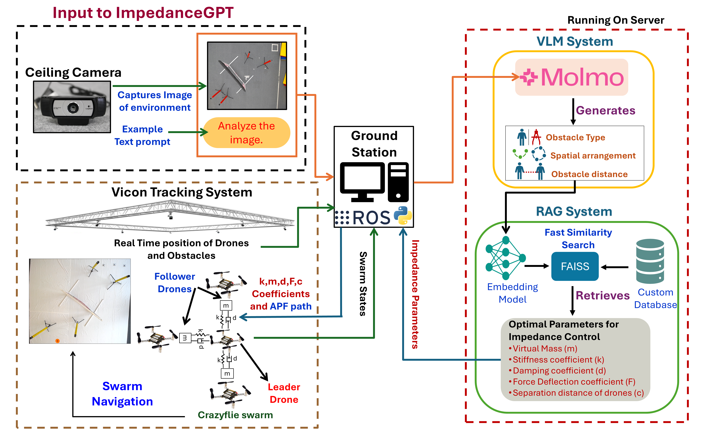
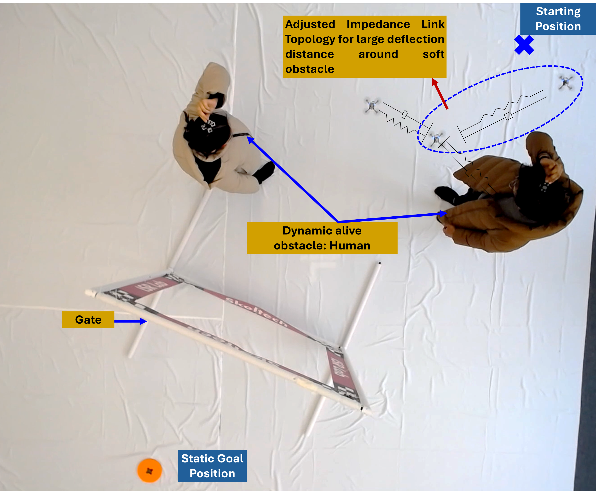
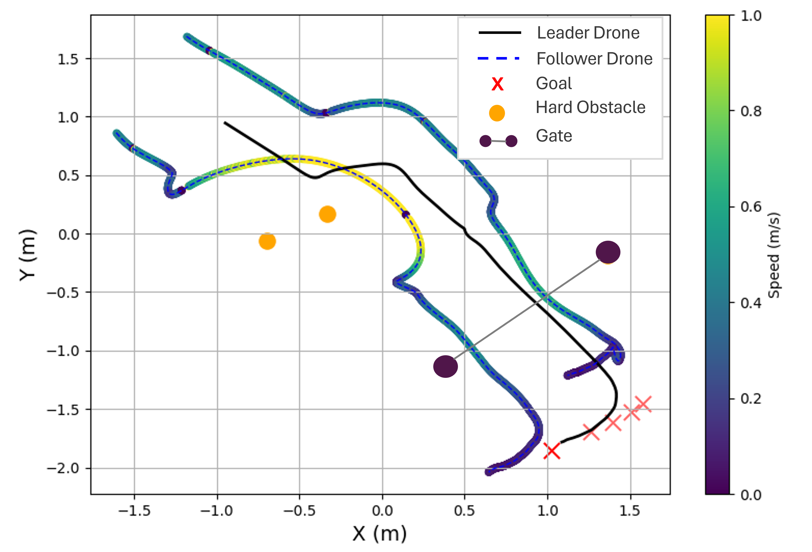
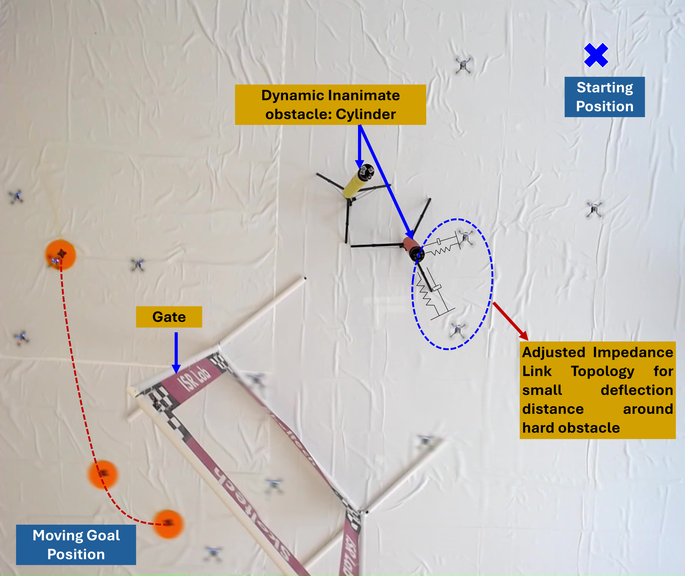
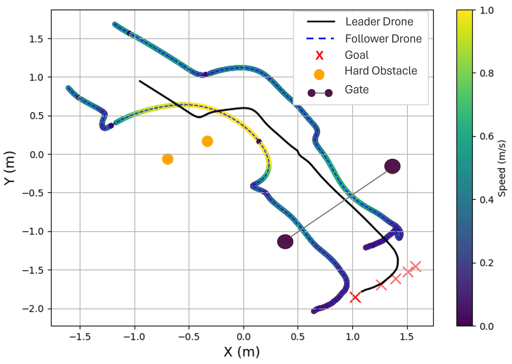
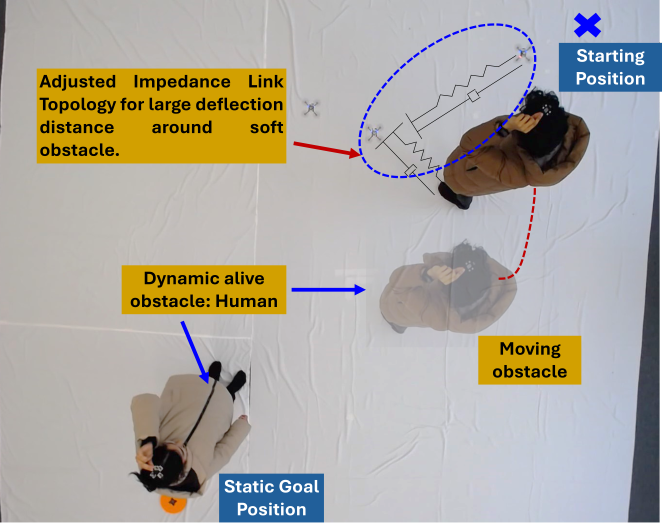
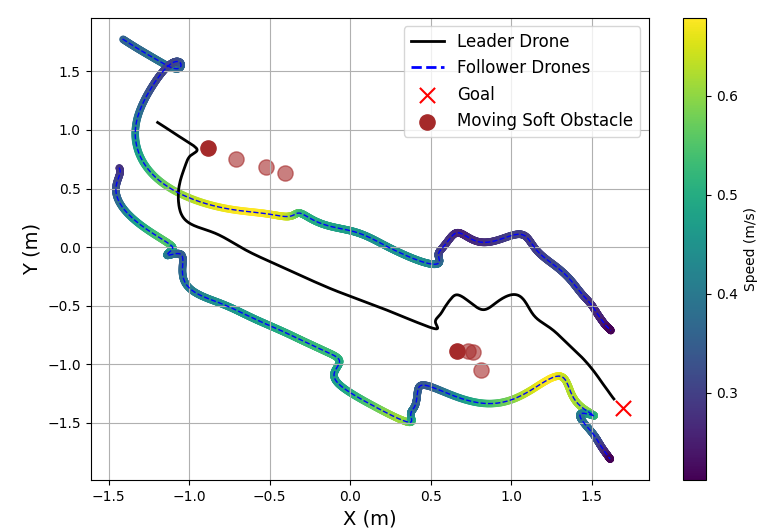

# ImpedanceGPT

This repository accompanies the research paper accepted at the **IEEE/RSJ International Conference on Intelligent Robots and Systems (IROS 2025)**.

It contains:
- Implementation details of the ImpedanceGPT framework.
- Dataset used for creating the RAG database.

## Table of Contents
- [Abstract](#abstract)
- [ImpedanceGPT Framework](#impedancegpt-framework)
- [Novelty](#novelty)
- [Installation](#installation)
- [Usage Instructions](#usage-instructions)
- [Experimental Results](#experimental-results)
- [Experiment Video](#experiment-video)
- [Citation](#citation)

## Abstract

Swarm robotics plays a crucial role in enabling autonomous operations in dynamic and unpredictable environments. However, a major challenge remains ensuring safe and efficient navigation in environments shared by both dynamic alive (e.g., humans) and dynamic inanimate (e.g., non-living objects) obstacles.

In this paper, we propose **ImpedanceGPT**, a novel system that combines a Vision-Language Model (VLM) with retrieval-augmented generation (RAG) to enable real-time reasoning for adaptive navigation of mini-drone swarm in complex environments.

The key innovation of **ImpedanceGPT** lies in the integration of VLM-RAG system with impedance control which is an active compliance strategy. This system provides the drones with enhanced semantic understanding of their surroundings and dynamically adjusts impedance control parameters in response to obstacle types and environmental conditions. Our approach not only ensures safe and precise navigation but also improves coordination between drones in the swarm.

Experimental evaluations demonstrate the effectiveness of the system. The VLM-RAG framework achieved an obstacle detection and retrieval accuracy of **80%** under optimal lighting. In static environments, drones navigated dynamic inanimate obstacles at **1.4 m/s** but slowed to **0.7 m/s** with increased safety margin/separation around humans. In dynamic environments, speed adjusted to **1.0 m/s** near hard obstacles, while reducing to **0.6 m/s** with higher deflection region to safely avoid moving humans.

https://arxiv.org/abs/2503.02723


## ImpedanceGPT Framework



The system transmits a top-down view from a ceiling camera, along with a user request, to Molmo. Molmo identifies obstacle types, distances, and arrangements, and then forwards this information to the Retrieval-Augmented Generation (RAG) system. The RAG system searches for and retrieves impedance parameters corresponding to the scenario that best matches Molmo’s description. These parameters are subsequently provided to the leader drone, which utilizes an Artificial Potential Field (APF) to navigate toward the goal.

## Novelty


We introduce **ImpedanceGPT**, a novel system for adaptive and intelligent swarm navigation.  
Our key contributions are:

- **VLM-RAG Integration**: Combines a Vision-Language Model (VLM) with Retrieval-Augmented Generation (RAG) to enable semantic understanding and context-aware impedance parameter prediction.
- **Scenario-Based Adaptability**: Uses a custom database to retrieve impedance parameters based on obstacle types, spatial arrangements, and environment semantics.
- **Robust Impedance Control**: Enhances navigation safety and adaptability for both dynamic living and inanimate obstacles in real-world, cluttered environments.


## Installation
For installation on server use the following commands
```bash
git clone https://github.com/Faryal-Batool/ImpedanceGPT.git
cd ImpedanceGPT
cd rag_vlm
pip install -r requirements.txt
```

For installation on ground station use the following commands
```bash
git clone https://github.com/Faryal-Batool/ImpedanceGPT.git
cd ImpedanceGPT
cd APF
pip install -r requirements.txt
```

## Usage Instructions

### Database Creation

The database was created using Gym-PyBullet simulation for **40 different scenarios**. For each scenario, the following information was stored in a JSON file:

- **Obstacle type**
- **A textual description** explaining the spatial arrangement and number of obstacles
- **Optimal impedance parameters** for navigation

The optimal parameters reflected:

- **Large deflection and soft compliance** for **soft obstacles**
- **Small deflection and rigid compliance** for **hard obstacles**

This data was saved in the file `rag_vlm/scenarios_description.json`. To prepare it for use with Retrieval-Augmented Generation (RAG), vector embeddings can be generated using the following script:

```
cd ImpedanceGPT/rag_vlm
python3 create_vector_embeddings.py
```

To run the VLM model and retrieve the corresponding impedance parameters based on the current scenario, use the following script:

```
cd ImpedanceGPT/rag_vlm
python3 rag_vlm.py
```

The impedance parameters output by the above script are then passed to the Artificial Potential Field (APF) planner, which uses them to control the swarm of drones. The code is written in ROS1. To run the full swarm navigation from start to goal using these parameters, execute:

```
cd ImpedanceGPT/APF
python3 swarm_vlm.py
```

## Experimental Results

<!-- Experiment 1 -->
<p align="center">
  
  
</p>

**Scenario 1**: With 4 static hard obstacles and a rectangular gate, the drones reached a maximum velocity of **1.4 m/s**. The significant overlap in trajectories indicates faster and more confident navigation.

<!-- Experiment 2 -->
<p align="center">
  
  
</p>

**Scenario 2**: Involving 2 static soft obstacles and a rectangular gate, the maximum velocity dropped to **0.7 m/s**, highlighting the system’s ability to modulate speed for safer navigation around soft obstacles.


<!-- Experiment 3 -->
<p align="center">
  
  
</p>

**Scenario 3**: Featuring hard obstacles, a gate, and a moving goal, the maximum velocity recorded was **1.0 m/s**. Drones effectively avoided obstacles while dynamically adjusting their paths.


<!-- Experiment 4 -->
<p align="center">
  
  
</p>

**Scenario 4**: With one dynamic and one static soft obstacle, the velocity further decreased to **0.6 m/s**, demonstrating the system’s adaptive response to ensure safety around soft, dynamic obstacles.

## Experiment Video

[](https://www.youtube.com/watch?v=JTdeg9bAzL4)


## Citation

```bibtex
@misc{batool2025impedancegptvlmdrivenimpedancecontrol,
      title={ImpedanceGPT: VLM-driven Impedance Control of Swarm of Mini-drones for Intelligent Navigation in Dynamic Environment}, 
      author={Faryal Batool and Malaika Zafar and Yasheerah Yaqoot and Roohan Ahmed Khan and Muhammad Haris Khan and Aleksey Fedoseev and Dzmitry Tsetserukou},
      year={2025},
      eprint={2503.02723},
      archivePrefix={arXiv},
      primaryClass={cs.RO},
      url={https://arxiv.org/abs/2503.02723}, 
}
```
