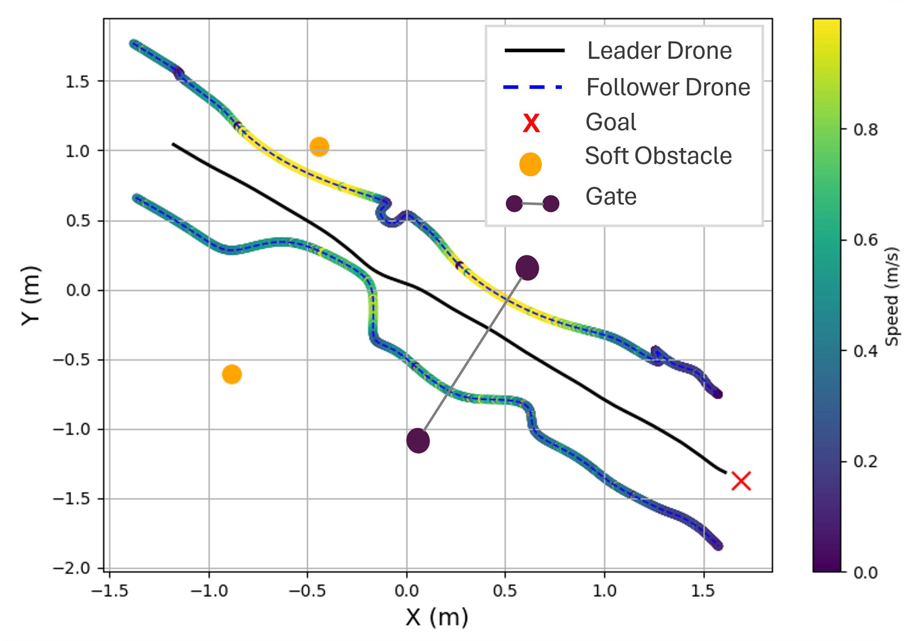

# ImpedanceGPT

This repository accompanies the research paper accepted at the **IEEE/RSJ International Conference on Intelligent Robots and Systems (IROS 2025)**.

It contains:
- Implementation details of the ImpedanceGPT framework.
- Dataset used for creating the RAG database.

## Table of Contents
- [Abstract](#abstract)
- [Dataset Collection](#dataset-collection)
- [ImpedanceGPT Framework](#impedancegpt-framework)
- [Novelty](#novelty)
- [Installation](#installation)
- [Usage Instructions](#usage-instructions)
- [Experimental Results](#experimental-results)
- [Experiment Video](#experiment-video)
- [Citation](#citation)

## Abstract

Swarm robotics plays a crucial role in enabling autonomous operations in dynamic and unpredictable environments. However, a major challenge remains ensuring safe and efficient navigation in environments shared by both dynamic alive (e.g., humans) and dynamic inanimate (e.g., non-living objects) obstacles.In this paper, we propose **ImpedanceGPT**, a novel system that combines a Vision-Language Model (VLM) with retrieval-augmented generation (RAG) to enable real-time reasoning for adaptive navigation of mini-drone swarm in complex environments.

The key innovation of **ImpedanceGPT** lies in the integration of VLM-RAG system with impedance control which is an active compliance strategy. This system provides the drones with enhanced semantic understanding of their surroundings and dynamically adjusts impedance control parameters in response to obstacle types and environmental conditions. Our approach not only ensures safe and precise navigation but also improves coordination between drones in the swarm.

Experimental evaluations demonstrate the effectiveness of the system. The VLM-RAG framework achieved an obstacle detection and retrieval accuracy of **80%** under optimal lighting. In static environments, drones navigated dynamic inanimate obstacles at **1.4 m/s** but slowed to **0.7 m/s** with increased safety margin/separation around humans. In dynamic environments, speed adjusted to **1.0 m/s** near hard obstacles, while reducing to **0.6 m/s** with higher deflection region to safely avoid moving humans.

https://arxiv.org/abs/2503.02723

## Dataset Collection

The **ImpedanceGPT** database was constructed using the Gym PyBullet simulator and contains optimal impedance parameters for **40 manually designed indoor navigation scenarios**. Each scenario includes different combinations of:

- Obstacle types (e.g., humans, furniture, walls)
- Obstacle counts
- Spatial arrangements

For each scenario, the following **impedance parameters** were recorded:

- Virtual Mass: \( m \)  
- Virtual Stiffness : \( k \)  
- Virtual Damping : \( d \)  
- External Virtual Force : \( F \)  
- Separation distance of drones: \( c \)  

These parameters were selected to ensure **safe and stable navigation** around different obstacle types using impedance-based control.


### 🧩 Understanding Soft vs. Rigid Compliance

Indoor environments often include both **animate (e.g., humans)** and **inanimate (e.g., walls, tables)** obstacles. To safely operate in such shared spaces, drones must adapt their behavior depending on the **risk of collision**, **required safety margin**, and **obstacle reactivity**.

#### 🔹 Soft Compliance (for Soft/Alive Obstacles like Humans)

Soft compliance aims to produce **gentle and energy-absorbing interactions** that reduce the risk of injury or discomfort. This is achieved with:

- **Low stiffness**\ (↓ k\): Allows smooth and flexible deviation around humans  
- **Moderate-to-high damping** \( ↑ d \): Prevents jitter and overshooting  
- **Higher virtual mass** \( ↑ m \): Ensures stable motion  
- **Larger separation distance** \( ↑ c \): Maintains a safe margin

These parameters result in **low-impact energy** and **gentle avoidance**, which are ideal for socially acceptable navigation near humans.

#### 🔹 Rigid Compliance (for Hard/Inanimate Obstacles)

Rigid compliance is used when navigating near solid, immovable obstacles that pose a **collision risk** but do not require gentle interaction. In such cases, the controller enforces **precise, firm responses** with:

- **High stiffness** \( ↑ k \): Quickly repels the drone away from the obstacle  
- **High damping** \( ↑ d \): Suppresses oscillations in tight spaces  
- **Low virtual mass** \( ↓ m \): Enables fast corrective actions  
- **Smaller separation distance** \( ↓ c \): Maintains proximity without safety risk


### 📏 How Optimal Parameters Were Selected

Each scenario in simulation was evaluated based on the following **optimality criteria**:

- **Collision-Free Swarm Navigation**: Drones maintain connectivity and avoid collisions  
- **Safe Obstacle Avoidance**:
  - **Low kinetic energy interaction** with humans  
  - **Stable deflection and low-impact force** around soft obstacles  
  - **Tight clearance with high control precision** around hard obstacles  
- **Control Stability**: Smooth response, no overshooting, and rapid recovery

Only the parameter sets that fulfilled these energy and safety-based criteria enabling **soft compliance for soft obstacles** and **rigid compliance for hard obstacles**  were retained in the database.

### 🔍 Example Scenarios

Below are two sample scenarios from our database:

1. **Scenario 1 (Rigid Compliance):** Two cylindrical inanimate obstacles  
2. **Scenario 2 (Soft Compliance):** A single human obstacle

 
These examples illustrate how **ImpedanceGPT** adjusts compliance behavior based on obstacle type to ensure both safety and efficiency during drone navigation in complex indoor environments.


## ImpedanceGPT Framework


The system transmits a top-down view from a ceiling camera, along with a user request, to Molmo. Molmo identifies obstacle types, distances, and arrangements, and then forwards this information to the Retrieval-Augmented Generation (RAG) system. The RAG system searches for and retrieves impedance parameters corresponding to the scenario that best matches Molmo’s description. These parameters are subsequently provided to the leader drone, which utilizes an Artificial Potential Field (APF) to navigate toward the goal.

## Novelty


We introduce **ImpedanceGPT**, a novel system for adaptive and intelligent swarm navigation.  
Our key contributions are:

- **VLM-RAG Integration**: Combines a Vision-Language Model (VLM) with Retrieval-Augmented Generation (RAG) to enable semantic understanding and context-aware impedance parameter prediction.
- **Scenario-Based Adaptability**: Uses a custom database to retrieve impedance parameters based on obstacle types, spatial arrangements, and environment semantics.
- **Robust Impedance Control**: Enhances navigation safety and adaptability for both dynamic living and inanimate obstacles in real-world, cluttered environments.


## Installation
For installation on server use the following commands
```bash
git clone https://github.com/Faryal-Batool/ImpedanceGPT.git
cd ImpedanceGPT
cd rag_vlm
pip install -r requirements.txt
```

For installation on ground station use the following commands
```bash
git clone https://github.com/Faryal-Batool/ImpedanceGPT.git
cd ImpedanceGPT
cd APF
pip install -r requirements.txt
```

## Usage Instructions

For each scenario, the following information was stored in a JSON file:

- **Obstacle type**
- **A textual description** explaining the spatial arrangement and number of obstacles
- **Optimal impedance parameters** for navigation


This data was saved in the file `rag_vlm/scenarios_description.json`. To prepare it for use with Retrieval-Augmented Generation (RAG), vector embeddings can be generated using the following script:

```
cd ImpedanceGPT/rag_vlm
python3 create_vector_embeddings.py
```

To run the VLM model and retrieve the corresponding impedance parameters based on the current scenario, use the following script:

```
cd ImpedanceGPT/rag_vlm
python3 rag_vlm.py
```

The impedance parameters output by the above script are then passed to the Artificial Potential Field (APF) planner, which uses them to control the swarm of drones. The code is written in ROS2. To run the full swarm navigation from start to goal using these parameters, execute:

```
cd ImpedanceGPT/APF
python3 swarm_vlm.py
```

## Experimental Results

<!-- Experiment 1 -->
<p align="center">
  
  
</p>

**Scenario 1**: With 4 static hard obstacles and a rectangular gate, the drones reached a maximum velocity of **1.4 m/s**. The significant overlap in trajectories indicates faster and more confident navigation.

<!-- Experiment 2 -->
<p align="center">
  
  
</p>

**Scenario 2**: Involving 2 static soft obstacles and a rectangular gate, the maximum velocity dropped to **0.7 m/s**, highlighting the system’s ability to modulate speed for safer navigation around soft obstacles.


<!-- Experiment 3 -->
<p align="center">
  
  
</p>

**Scenario 3**: Featuring hard obstacles, a gate, and a moving goal, the maximum velocity recorded was **1.0 m/s**. Drones effectively avoided obstacles while dynamically adjusting their paths.


<!-- Experiment 4 -->
<p align="center">
  
  
</p>

**Scenario 4**: With one dynamic and one static soft obstacle, the velocity further decreased to **0.6 m/s**, demonstrating the system’s adaptive response to ensure safety around soft, dynamic obstacles.

## Experiment Video

[](https://www.youtube.com/watch?v=JTdeg9bAzL4)


## Citation

```bibtex
@misc{batool2025impedancegptvlmdrivenimpedancecontrol,
      title={ImpedanceGPT: VLM-driven Impedance Control of Swarm of Mini-drones for Intelligent Navigation in Dynamic Environment}, 
      author={Faryal Batool and Malaika Zafar and Yasheerah Yaqoot and Roohan Ahmed Khan and Muhammad Haris Khan and Aleksey Fedoseev and Dzmitry Tsetserukou},
      year={2025},
      eprint={2503.02723},
      archivePrefix={arXiv},
      primaryClass={cs.RO},
      url={https://arxiv.org/abs/2503.02723}, 
}
```
